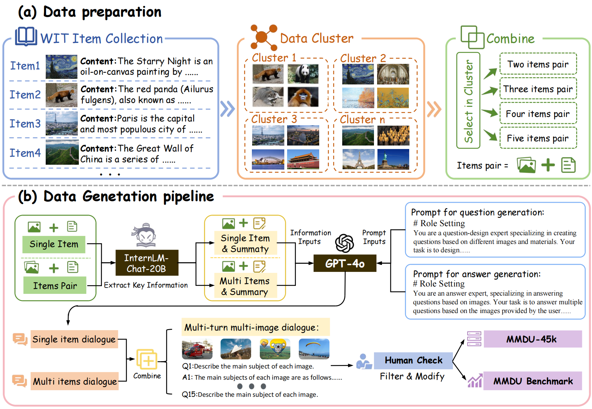

<p align="center">
  <h1 align="center"></h1>
  <h1 align="center">MMDU: A Multi-Turn Multi-Image Dialog Understanding Benchmark and Instruction-Tuning Dataset for LVLMs</h1>
    <p align="center">
    <a href="https://github.com/Liuziyu77"><strong>Ziyu Liu</strong></a>
    ·
    <a href="https://github.com/SunzeY"><strong>Tao Chu</strong></a>
    ·
    <a href="https://yuhangzang.github.io/"><strong>Yuhang Zang</strong></a>
    ·
    <strong>Xilin Wei</strong>
    ·
    <a href="https://lightdxy.github.io/"><strong>Xiaoyi Dong</strong></a>
    ·
    <a href="https://panzhang0212.github.io/"><strong>Pan Zhang</strong></a>
    ·
    <strong>Zijian Liang</strong>
    ·
     <a href="http://yjxiong.me/"><strong>Yuanjun Xiong</strong></a>
      ·
     <strong>Yu Qiao</strong>
    ·
     <a href="http://dahua.site/"><strong>Dahua Lin</strong></a>
    ·
     <a href="https://myownskyw7.github.io/"><strong>Jiaqi Wang</strong></a>
  </p>
  <h2 align="center">Accepted By NeurIPS2024 Dataset and Benchmark Track!</h2>
  📖<a href="https://arxiv.org/abs/2406.11833">Paper</a> |🏠<a href="https://liuziyu77.github.io/MMDU/">Homepage</a></h3>|🤗<a href="https://huggingface.co/datasets/laolao77/MMDU">Huggingface</a></h3>
<div align="center"></div>
<p align="center">
  <p>
Generating natural and meaningful responses to communicate with multi-modal human inputs is a fundamental capability of Large Vision-Language Models (LVLMs). While current open-source LVLMs demonstrate promising performance in simplified scenarios such as single-turn single-image input, they fall short in real-world conversation scenarios such as following instructions in a long context history with multi-turn and multi-images. Existing LVLM benchmarks primarily focus on single-choice questions or short-form responses, which do not adequately assess the capabilities of LVLMs in real-world human-AI interaction applications.
    
🌈Therefore, we introduce <strong>MMDU</strong>, a comprehensive benchmark, and <strong>MMDU-45k</strong>, a large-scale instruction tuning dataset, designed to evaluate and improve LVLMs' abilities in <strong>multi-turn and multi-image conversations</strong>.
  </p>
  <a href="">
    
  </a>
<br>

## 📢 News
- 🚀 [09/28/2024] Our paper is accepted by NeurIPS2024!
- 🚀 [08/12/2024] We release the code to finetune LLaVa-v1.5-7b on multi-images datasets.
- 🚀 [07/1/2024] We will add MMDU Benchmark to evaluation toolkit [VLMEvalKit](https://github.com/open-compass/VLMEvalKit) soon, providing a highly convenient testing solution!
- 🚀 [06/13/2024] We upload our MMDU-45k dataset to huggingface.
- 🚀 [06/13/2024] We upload our MMDU benchmark to huggingface.

## 💡 Highlights
- 🔥 **Multi-turn and Multi-image**: Our benchmark showcases a conversational setting with a maximum of 20 images and 17 turns, thereby surpassing the scope of preceding works and authentically replicating real-world chat assistant interactions. 
- 🔥 **Long Context**: With a maximum of 18k text+image tokens, MMDU evaluates the capacity of LVLMs to process and comprehend extended contextual information with a long context history.
- 🔥 **Open-ended Evaluation**: Departing from traditional benchmarks that rely on close-ended questions with concise outputs (eg, multiple-choice questions or short answers), our benchmark adopts a more realistic and nuanced approach, assessing LVLM's performance through free-form multi-turn outputs that prioritize scalability and explainability.

## 💎 MMDU Benchmark
Although many LVLMs now claim to handle tens of thousands, hundreds of thousands, or even millions of tokens in length, their actual performance significantly declines in real-world applications as the number of images or the length of the context increases. Both the dialogue quality and image recognition capabilities of LVLMs deteriorate notably under these conditions.

To evaluate the multi-image multi-turn dialogue capabilities of existing models, we have developed the MMDU Benchmark. Our benchmark comprises **110 high-quality multi-image multi-turn dialogues with more than 1600 questions**, each accompanied by detailed long-form answers. Previous benchmarks typically involved only single images or a small number of images, with fewer rounds of questions and short-form answers. However, MMDU significantly increases the number of images, the number of question-and-answer rounds, and the in-context length of the Q&A. The questions in MMUD **involve 2 to 20 images**, with **an average image&text token length of 8.2k tokens**, and **a maximum image&text length reaching 18K tokens**, presenting significant challenges to existing multimodal large models. 

<a href="">
  
</a>

## 🎆 MMDU-45k Instruct Tuning Dataset
In the MMDU-45k, we construct a total of 45k instruct tuning data conversations. Each data in our MMDU-45k dataset features an ultra-long context, with **an average image&text token length of 5k** and **a maximum image&text token length of 17k** tokens. Each dialogue contains **an average of 9 turns of Q&A**, with **a maximum of 27 turns**. Additionally, each data includes content from 2-5 images. The dataset is constructed in a well-designed format, providing excellent scalability. It can be expanded to generate a larger number and longer multi-image, multi-turn dialogues through combinations. ***The image-text length and the number of turns in MMDU-45k significantly surpass those of all existing instruct tuning datasets.*** This enhancement greatly improves the model's capabilities in multi-image recognition and understanding, as well as its ability to handle long-context dialogues. 

The diagram below illustrates the process of constructing MMDU and MMDU-45k.
<a href="">
  
</a>

## 🎇 Finetune with MMDU-45k
The model fine-tuned with MMDU-45k has shown significant improvements in multi-image recognition and long-text dialogue capabilities. As demonstrated in the following case, the fine-tuned InternLM-Xcomposer2 is able to provide richer responses and more accurate visual information compared to before.
<a href="">
  
</a>
Additionally, the model fine-tuned with MMDU-45k has shown performance improvements on eight benchmarks, including MMBench, MMvet, and MMMU.

## 🛠️ Usage
### Support Models
We now support various popular open-source and closed-source LVLMs, including **GPT-4V**, **Claude**, **LLaVa**, **LLaVa-Next**, **InternLM-Xcomposer2**, **Qwen-VL**, **idefics2**, **deepseek_vl**, **MiniCPM**, and**more**. Our evaluation process consists of two steps: the first step uses the code in the `model_generation` folder to generate results, and the second step uses the code in the `score` folder to judgement and statistic the results.

Additionally, our MMDU will soon be integrated into [VLMEvalKit](https://github.com/open-compass/VLMEvalKit), an open-source evaluation toolkit of large vision-language models, providing users with a convenient testing solution.

### Generate Answers
To perform testing on MMDU, we needed to modify the inference code for the various models to support multi-image and multi-turn dialogues. We have prepared some testing scripts for currently available open-source and closed-source models in the `./model/generation` folder.
You only need to modify the model's weight path and the path to the MMDU `benchmark.json` file. Each test result will be saved in a separate JSON file.
### Judgement
Use the `./scores/prompt.py` script to score the model's responses. Users need to provide the following information in the script:
```
api_key = ""   ### your OpenAI API key
file_save_fold = ""    ### Save the scores and reason given by judgment model
file_get_fold = ""    ### The previously saved JSON files from "Generate Answers"
```
Finally, the multi-turn dialogue scoring results for each conversation will be saved as a separate JSON file in `file_save_fold`.

To get the final scores, run `./scripts/statistic.py` to obtain **each aspect's scores**、**the overall scores** and **question count**. These scores, multiplied by ten, will be the final results.

## ✒️Citation
```
@article{liu2024mmdu,
  title={MMDU: A Multi-Turn Multi-Image Dialog Understanding Benchmark and Instruction-Tuning Dataset for LVLMs},
  author={Liu, Ziyu and Chu, Tao and Zang, Yuhang and Wei, Xilin and Dong, Xiaoyi and Zhang, Pan and Liang, Zijian and Xiong, Yuanjun and Qiao, Yu and Lin, Dahua and others},
  journal={arXiv preprint arXiv:2406.11833},
  year={2024}
}
```

## 📄 License
  **Usage and License Notices**: The data and code are intended and licensed for research use only.
License: Attribution-NonCommercial 4.0 International It should abide by the policy of OpenAI: https://openai.com/policies/terms-of-use
